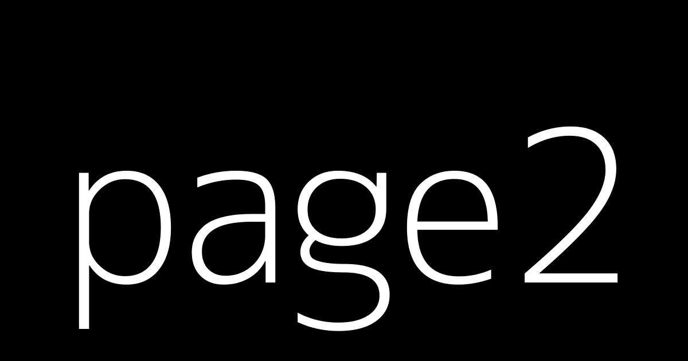

# page2

インボイス制度 (適格請求書等保存方式) の概要パンフレット P19 によると、免税事業者が 23/3/31 までに適格請求書発行登録をしておけば、特例として 23/10/1 から課税事業者となることが可能 (通常は年度開始日から) であり「課税事業者選択届出書」の提出は必要ないらしい。

ただし 2021 年度に 1,000 万円 (税込) を超える売上がある場合は、2023 年度の課税期間開始日から課税事業者になってしまうので、この特例は適用されない。

インボイス制度 (適格請求書等保存方式) の概要パンフレット P20 によると、免税事業者が 23/10/1 に適格請求書発行事業者になると自動で課税事業者になる上に、簡易課税制度選択届出をその課税期間中に提出すれば 23/10/1 から簡易課税制度を適用できる。つまり、どういうことか分かるか？

適格請求書発行者申請は今してもいいが、簡易課税制度選択届出と提出先が違うため、インボイス制度開始期の基準期間となる今年分の確定申告後がベストタイミング。これは、基準期間売上高が一千万円以下であることを確定させた後の方が、事務処理がスムーズにいく可能性が高いため (国税局に相談済)。
