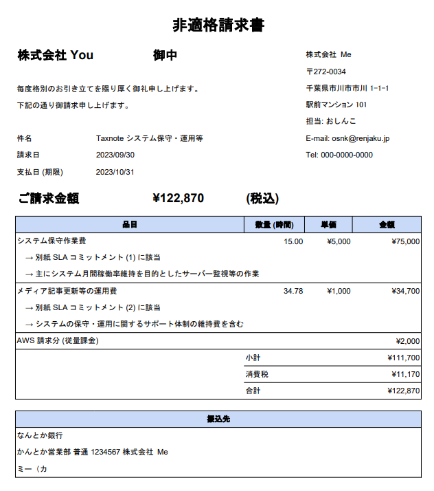
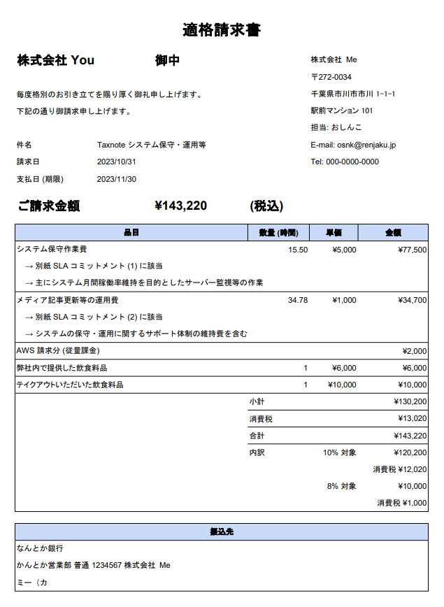

# 消費税の軽減税率制度

2019/10/01 (令和 1 年) より始まった、対象商品を購入する際の消費税の税率が、標準の 10% ではなく 8% に軽減される制度のこと。

## [インボイス制度](https://www.nta.go.jp/taxes/shiraberu/zeimokubetsu/shohi/keigenzeiritsu/)

- 商品ごとに適用される税率を請求書に明記する制度のこと
- 正式名称を「適格請求書等保存方式」という
- 軽減税率制度の導入に伴い 2023/10/01 (令和 5 年) から始まる

### 従来の請求書との比較

  
  

### 要点

- [令和５年10月１日から適格請求書発行事業者の登録を受けるためには、原則として令和３年10月１日から令和５年３月3１日までに提出する必要がある](https://www.nta.go.jp/taxes/tetsuzuki/shinsei/annai/hojin/annai/invoice_01.htm)
- インボイス制度を適用するには課税事業者になる必要がある
- 課税事業者の「[簡易課税制度を選択している場合はインボイスの保存は仕入税額控除の要件ではない](https://www.nta.go.jp/taxes/shiraberu/zeimokubetsu/shohi/keigenzeiritsu/pdf/0017007-067_15.pdf)」らしい
    - みなし仕入率で計算するから、課税仕入れに係る消費税額の根拠となるインボイスは保存しておく必要がない、ということ

### 登録申請手続

- [適格請求書発行事業者の登録申請手続（国内事業者用）](https://www.nta.go.jp/taxes/tetsuzuki/shinsei/annai/hojin/annai/invoice_01.htm)に申請書と記載例がある
    - 個人も法人も同じ様式
    - [e-Tax で提出することも可能](https://www.e-tax.nta.go.jp/tetsuzuki/shinsei/shinsei04_1.htm)
        - 提出の際に出力される申請内容ファイル (.wxtx) を保管しておくと良い
- [公表事項の変更申出書](https://www.nta.go.jp/taxes/tetsuzuki/shinsei/annai/hojin/annai/invoice_04.htm)は、多くの個人事業主は出さなくて良い
    - 公表サイトで表示する項目として、屋号や事務所の所在地など、新たに追加する申出書のこと
    - 追加する項目は、個別で選択できる
        - 屋号だけ追加することも、屋号と事務所の所在地の両方を追加することも可能、という意味
- 申請が通った後
    - 登録番号 (T から始まる 13 桁の半角数字) が送られてくるので保管する
    - [公表サイト](https://www.invoice-kohyo.nta.go.jp/)より、情報を確認できる

### 免税事業者の場合

[インボイス制度 (適格請求書等保存方式) の概要パンフレット](https://www.nta.go.jp/taxes/shiraberu/zeimokubetsu/shohi/keigenzeiritsu/pdf/0020006-027.pdf) P19 によると、免税事業者が 23/3/31 までに適格請求書発行登録をしておけば、特例として 23/10/1 から課税事業者となることが可能 (通常は年度開始日から) であり「課税事業者選択届出書」の提出は必要ないらしい。

ただし 2021 年度に 1,000 万円 (税込) を超える売上がある場合は、2023 年度の課税期間開始日から課税事業者になってしまうので、この特例は適用されない。

インボイス制度 (適格請求書等保存方式) の概要パンフレット P20 によると、免税事業者が 23/10/1 に適格請求書発行事業者になると自動で課税事業者になる上に、簡易課税制度選択届出をその課税期間中に提出すれば 23/10/1 から簡易課税制度を適用できる。

適格請求書発行者申請は今してもいいが、簡易課税制度選択届出と提出先が違うため、インボイス制度開始期の基準期間となる今年分の確定申告後がベストタイミング。これは、基準期間売上高が一千万円以下であることを確定させた後の方が、事務処理がスムーズにいく可能性が高いため (国税局に相談済)。

### 課税事業者の取引シミュレーション

<iframe src="https://docs.google.com/spreadsheets/d/e/2PACX-1vRCLruAZMNo7U-5DijU1kRQFlSVq5QKOZ2tzhovAeSOgYfilYNy_j96NxW5KCDaBFTLwZBA_2gK4dO1/pubhtml?gid=74925062&amp;single=true&amp;widget=true&amp;headers=false" style="width: 100%; height: 640px"></iframe>
